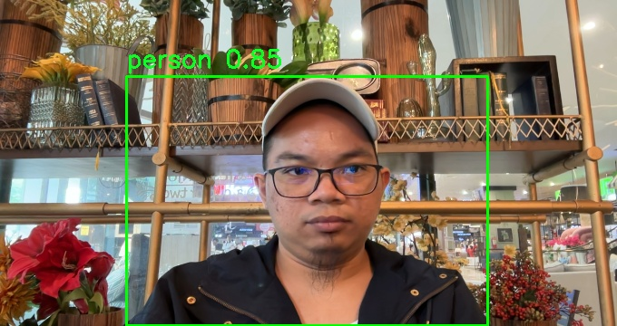

# Human Detection
This Human Detection App leverages advanced computer vision techniques to accurately detect human presence in video streams. The app is capable of identifying and tracking human figures in real-time.

install [anaconda](https://anaconda.org/anaconda/conda)
```
conda create -n <your-env> python=3.9
conda activate <your-env>
pip install -r requirements.txt
python human-detections.py
```

## Sample Output
### Snapshot


### Human Detection


##
<center>🚀🚀🚀 Happy Coding 🚀🚀🚀</center>